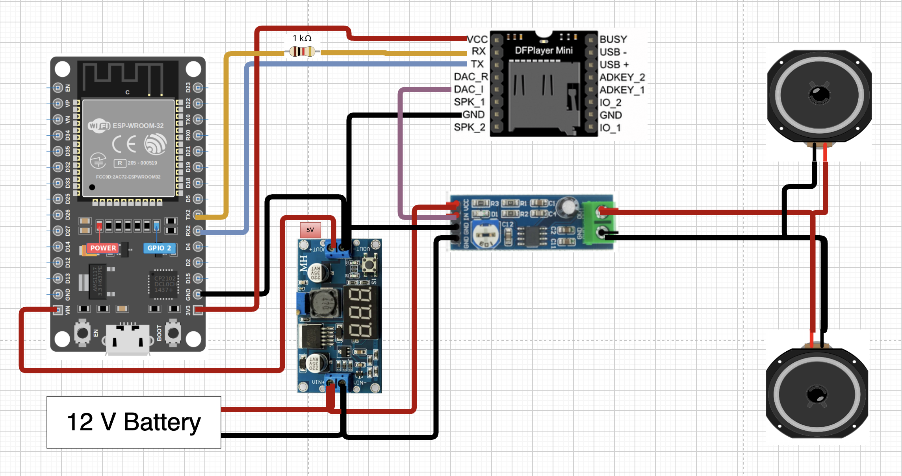
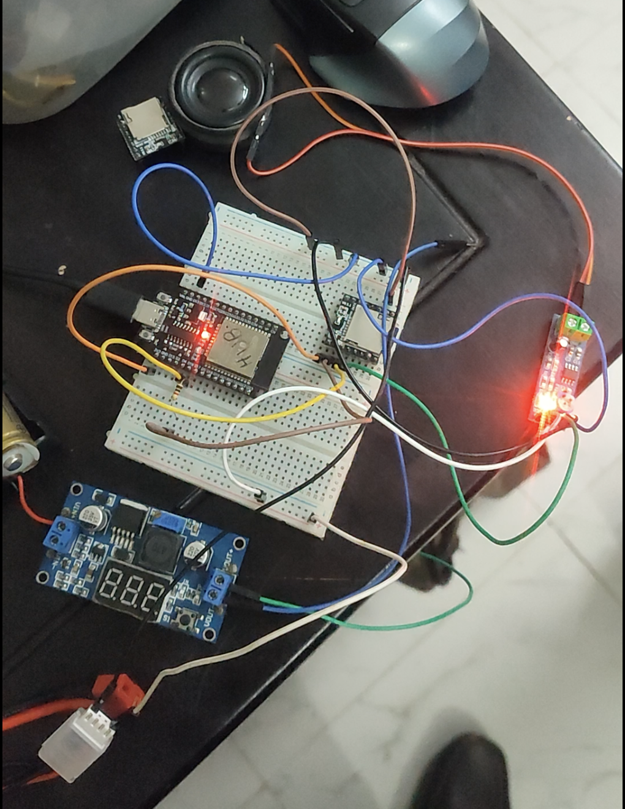
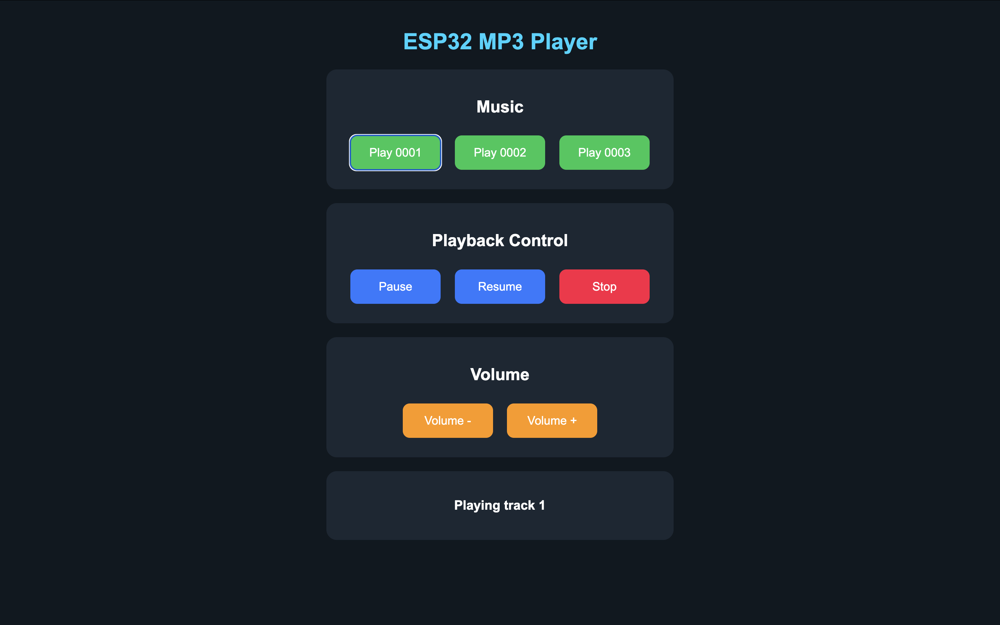

# ESP32 DFPlayer Web Audio System
An ESP32-based audio playback and control system developed by ZAN Tech.

The system uses a DFPlayer Mini for MP3 playback, an LM386 amplifier
for audio amplification, and an ESP32 DevKit V1 for control.

Audio can be controlled through both a local web interface and
the Arduino Serial Monitor.
## 01. Project Overview
This project is an ESP32-based MP3 audio playback system.

The ESP32 communicates with a DFPlayer Mini using UART communication.
The DFPlayer reads MP3 files from a microSD card.

The audio signal is sent to an LM386 amplifier, which drives a
3W 4Ω speaker.

The ESP32 also creates its own Wi-Fi Access Point and hosts a local
web server for wireless audio control.

## 02. Features
- MP3 playback from microSD card
- ESP32 Wi-Fi Access Point
- Local web-based control
- Serial Monitor control
- Play multiple audio tracks
- Pause audio
- Resume audio
- Stop audio
- Volume Up
- Volume Down
- No internet connection required
- External audio amplification using LM386

## 03. Components Required
| Component | Quantity |
|---|---:|
| ESP32 DevKit V1 | 1 |
| DFPlayer Mini MP3 Module | 1 |
| LM386 Audio Amplifier Module | 1 |
| 3W 4Ω Speaker | 1 |
| MicroSD Card | 1 |
| 1kΩ Resistor | 1 |
| External 5V Power Supply | 1 |
| Jumper Wires | As required |

## 04. Circuit Diagram



## 05. Pin Connection
### ESP32 → DFPlayer Mini

| ESP32 DevKit V1 | DFPlayer Mini |
|---|---|
| GPIO 17 (TX2) | RX through 1kΩ resistor |
| GPIO 16 (RX2) | TX |
| GND | GND |
| 5V | VCC |

### DFPlayer Mini → LM386

| DFPlayer Mini | LM386 |
|---|---|
| DAC_L | Audio IN |
| GND | GND |

### LM386 → Speaker

| LM386 | Speaker |
|---|---|
| OUT+ | Speaker + |
| OUT- | Speaker - |

### Power

ESP32, DFPlayer Mini and LM386 must share a common ground.

---

## 06. Software Requirements

The following software is required:

- Arduino IDE
- ESP32 Board Package
- DFRobotDFPlayerMini Library
- Web Browser
- USB Driver if required by the ESP32 board

---

## 07. Library Installation

Open Arduino IDE.

Go to:

`Sketch → Include Library → Manage Libraries`

Search for:

`DFRobotDFPlayerMini`

Install the library.

The following libraries are used:

```cpp
#include <WiFi.h>
#include <WebServer.h>
#include <DFRobotDFPlayerMini.h>

## 08. Source Code

Source code:
`src/ESP32_DFPlayer_Web_Control.ino`

## 09. How It Works

The ESP32 DFPlayer Web Audio System allows users to play and control MP3 audio files using both a **local web interface** and the **Arduino Serial Monitor**.

The overall working process is as follows:

1. The ESP32 starts and initializes serial communication with the **DFPlayer Mini** using UART.

2. The DFPlayer Mini reads MP3 files stored on the **microSD card**.

3. The ESP32 creates its own Wi-Fi Access Point:

   ```text
   SSID: ESP32-MP3
   Password: 12345678
   ```

4. A local web server is started on the ESP32.

5. A phone, laptop, or other Wi-Fi-enabled device can connect directly to the ESP32 Wi-Fi network.

6. The user opens the following local IP address in a web browser:

   ```text
   http://192.168.4.1
   ```

7. The web interface allows the user to send commands such as:

   - Play Track
   - Pause
   - Resume
   - Stop
   - Volume Up
   - Volume Down

8. The ESP32 receives the command and sends the corresponding instruction to the DFPlayer Mini through UART communication.

9. The DFPlayer Mini reads the selected MP3 file from the microSD card and generates the audio signal.

10. The audio signal from the DFPlayer Mini is sent to the **LM386 Audio Amplifier Module**.

11. The LM386 amplifies the audio signal and drives the **3W 4Ω speaker**.

The system can also receive commands directly from the Arduino Serial Monitor.

### System Flow

```text
Phone / Laptop
      │
      │ Wi-Fi
      ▼
ESP32 Local Web Server
      │
      │ UART
      ▼
DFPlayer Mini
      │
      │ Audio Signal
      ▼
LM386 Amplifier
      │
      ▼
3W 4Ω Speaker
```

---

## 10. Setup Instructions

Follow the steps below to set up the complete system.

### Step 1 — Prepare the microSD Card

Format the microSD card using the **FAT32** file system.

Create a folder named:

```text
MP3
```

Store the audio files using four-digit filenames:

```text
MP3/
├── 0001.mp3
├── 0002.mp3
└── 0003.mp3
```

Make sure the filenames follow the required numbering format.

---

### Step 2 — Connect the Hardware

Connect the components according to the circuit diagram and pin connection table.

The main connections are:

```text
ESP32
  │
  ├── UART ──────> DFPlayer Mini
  │
  │                 │
  │                 └── DAC_L ──> LM386 Amplifier
  │                                  │
  │                                  └──> 3W 4Ω Speaker
  │
  └── Common GND
```

Make sure that the following devices share a **common ground**:

- ESP32
- DFPlayer Mini
- LM386 Amplifier
- External Power Supply

> Do not power the speaker or amplifier directly from the ESP32 3.3V pin.

---

### Step 3 — Install the Required Library

Open **Arduino IDE** and go to:

```text
Sketch → Include Library → Manage Libraries
```

Search for:

```text
DFRobotDFPlayerMini
```

Install the library.

---

### Step 4 — Connect the ESP32

Connect the ESP32 DevKit V1 to the computer using a USB cable.

In Arduino IDE, select:

```text
Tools → Board → ESP32 Arduino → ESP32 Dev Module
```

Then select the correct serial port:

```text
Tools → Port
```

---

### Step 5 — Upload the Program

Open:

```text
src/ESP32_DFPlayer_Web_Control.ino
```

Compile the program and upload it to the ESP32.

---

### Step 6 — Open Serial Monitor

After uploading the program, open:

```text
Tools → Serial Monitor
```

Set the baud rate to:

```text
115200
```

After successful initialization, information similar to the following should appear:

```text
ESP32 MP3 Player Starting...
DFPlayer Connected!

WiFi Ready!
WiFi Name: ESP32-MP3
Password: 12345678
Open Browser: http://192.168.4.1

Web Server Started!
```

---

### Step 7 — Connect to ESP32 Wi-Fi

Using a phone or laptop, open Wi-Fi settings and connect to:

```text
Wi-Fi: ESP32-MP3
Password: 12345678
```

An internet connection is not required.

---

### Step 8 — Open the Web Interface

Open a web browser and enter:

```text
http://192.168.4.1
```

The ESP32 MP3 Player control interface should appear.

You can now control the audio directly from the browser.

---

## 11. Testing

After completing the setup, test each part of the system separately.

### Test 1 — DFPlayer Detection

Restart the ESP32 and open the Serial Monitor.

A successful connection should display:

```text
DFPlayer Connected!
```

If the DFPlayer cannot be detected, check the UART connections and power supply.

---

### Test 2 — Serial Monitor Audio Control

Set the Serial Monitor baud rate to:

```text
115200
```

Use the following commands:

| Command | Function |
|:---:|---|
| `1` | Play `0001.mp3` |
| `2` | Play `0002.mp3` |
| `3` | Play `0003.mp3` |
| `p` | Pause |
| `r` | Resume |
| `s` | Stop |
| `+` | Volume Up |
| `-` | Volume Down |

For example, sending:

```text
1
```

should play:

```text
MP3/0001.mp3
```

---

### Test 3 — Wi-Fi Access Point

Check the available Wi-Fi networks on a phone or laptop.

The following network should appear:

```text
ESP32-MP3
```

Connect using:

```text
12345678
```

---

### Test 4 — Web Server

After connecting to the ESP32 Wi-Fi network, open:

```text
http://192.168.4.1
```

Verify that the control interface loads correctly.

---

### Test 5 — Web Audio Control

Test all available buttons:

- Play 0001
- Play 0002
- Play 0003
- Pause
- Resume
- Stop
- Volume Up
- Volume Down

The corresponding action should occur immediately on the DFPlayer Mini.

---

### Test 6 — Audio Output

Check that:

- Audio is clear
- Speaker volume is sufficient
- LM386 is not overheating
- There is no excessive noise or distortion
- Audio does not cause the ESP32 to restart

---

## 12. Troubleshooting

### DFPlayer Mini Not Detected

**Possible causes:**

- Incorrect TX/RX connection
- No power to DFPlayer Mini
- Missing common ground
- Incorrect UART pins
- Faulty DFPlayer module

**Solution:**

Verify:

```text
ESP32 GPIO17 (TX) → DFPlayer RX
ESP32 GPIO16 (RX) ← DFPlayer TX
ESP32 GND         → DFPlayer GND
```

Also verify that the DFPlayer Mini receives a stable power supply.

---

### MP3 File Does Not Play

Check the microSD card structure:

```text
MP3/
├── 0001.mp3
├── 0002.mp3
└── 0003.mp3
```

Also check:

- microSD card is formatted correctly
- MP3 file is valid
- Filename is correct
- Card is inserted properly

---

### No Sound from Speaker

Check:

```text
DFPlayer DAC_L → LM386 Audio IN
DFPlayer GND   → LM386 GND
```

Then verify the LM386 output connection to the speaker.

Also increase the software volume if necessary.

---

### Distorted or Noisy Audio

Possible causes include:

- Unstable power supply
- Poor grounding
- Very high amplifier gain
- Loose connections
- Power noise

Use a stable external power source and ensure all modules share a common ground.

---

### ESP32 Wi-Fi Network Not Showing

Press the ESP32 **EN/RESET** button.

Open Serial Monitor and verify that:

```text
WiFi Ready!
```

is displayed.

---

### Web Interface Does Not Open

Make sure the phone or laptop is connected to:

```text
ESP32-MP3
```

Then manually enter:

```text
http://192.168.4.1
```

Some phones may display **"No Internet Connection"** after connecting to the ESP32. This is normal because the ESP32 is operating as a local Access Point.

---

### ESP32 Randomly Restarts

This may indicate an unstable or insufficient power supply.

Check:

- Power supply current capability
- Wiring
- Common ground
- Loose USB connection
- Amplifier power requirements

Avoid powering high-current loads from the ESP32 3.3V output.

---

## 13. Applications

The ESP32 DFPlayer Web Audio System can be used in many robotics, IoT, and educational applications.

Possible applications include:

- 🤖 Talking Robots
- 🏠 Smart Home Voice Notifications
- 📢 Automatic Announcement Systems
- 🚨 Warning and Alert Systems
- 🏫 Educational Robotics Projects
- 🖼️ Interactive Exhibits
- 🏛️ Museum Information Systems
- 🚗 Smart Vehicle Audio Systems
- 👤 Human-Following Robots
- 🦾 Service Robots
- 🔔 Sensor-Triggered Voice Alerts
- 🌐 IoT Audio Notification Systems
- 🎓 STEM and Robotics Training Projects

For example, a robot can use different MP3 files to provide voice feedback for events such as:

```text
0001.mp3 → "Hello! Welcome."
0002.mp3 → "Obstacle detected."
0003.mp3 → "Battery level is low."
```

---

## 14. Future Improvements

The current system can be expanded with additional hardware and software features.

### 1. Sensor-Triggered Audio

Sensors such as:

- PIR Motion Sensor
- Ultrasonic Sensor
- IR Sensor
- Temperature Sensor

could automatically trigger specific audio messages.

Example:

```text
Obstacle Detected
       │
       ▼
     ESP32
       │
       ▼
Play 0002.mp3
```

---

### 2. Physical Control Buttons

Physical buttons could be added for:

- Play
- Pause
- Next
- Previous
- Volume Up
- Volume Down

This would allow the system to operate without a phone or computer.

---

### 3. OLED Display

An OLED display could show:

- Current track
- Volume level
- Wi-Fi status
- Playback status

---

### 4. Mobile Application

A dedicated Android or iOS application could replace the browser-based control interface.

Communication could be implemented using:

- Wi-Fi
- Bluetooth
- BLE

---

### 5. MQTT / IoT Integration

The ESP32 could connect to an MQTT broker for remote audio control.

Example:

```text
Cloud / MQTT
     │
     ▼
   ESP32
     │
     ▼
 DFPlayer
     │
     ▼
  Speaker
```

---

### 6. Voice Command Control

Voice recognition could be integrated so that audio playback can be controlled using spoken commands.

---

### 7. Robot Voice System

The project can be integrated into robots to provide different voice responses based on robot actions or sensor events.

For example:

```text
Robot Starts      → 0001.mp3
Obstacle Detected → 0002.mp3
Task Completed    → 0003.mp3
Low Battery       → 0004.mp3
```

---

### 8. Dynamic Web Interface

The web interface can be improved with:

- Current track display
- Real-time playback status
- Volume slider
- Track list
- Previous/Next buttons
- Responsive mobile interface

---

### 9. REST API

A REST API could be added so other devices or applications can control the audio system.

Example commands could include:

```text
/play?track=1
/pause
/resume
/stop
/volumeup
/volumedown
```

---

### 10. Complete Smart Audio Controller

Future versions could combine:

```text
Sensors
   │
   ├──────────────┐
   ▼              ▼
 ESP32 ←──── Web / Mobile App
   │
   ├──── DFPlayer Mini
   │         │
   │         ▼
   │      Amplifier
   │         │
   │         ▼
   │      Speaker
   │
   ├──── OLED Display
   │
   └──── MQTT / IoT
```

This would transform the project from a simple MP3 player into a complete **Smart Audio and Voice Feedback System for Robotics and IoT applications**.

---

## 15. Project Images

### Hardware Setup


### Web Interface


## 16. Authors
Developed by ZAN Tech

## 17. License
MIT License